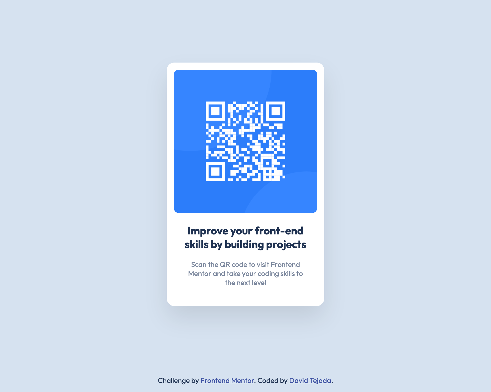

# Frontend Mentor - QR code component solution

This is a solution to the [QR code component challenge on Frontend Mentor](https://www.frontendmentor.io/challenges/qr-code-component-iux_sIO_H). Frontend Mentor challenges help you improve your coding skills by building realistic projects.

## Table of contents

- [Overview](#overview)
  - [Screenshot](#screenshot)
  - [Links](#links)
- [My process](#my-process)
  - [Built with](#built-with)
  - [What I learned](#what-i-learned)
  - [Useful resources](#useful-resources)
- [Author](#author)

## Overview

### Screenshot



### Links

- Solution URL: [david-tejada/frontendmentor-qr-code-component](https://github.com/david-tejada/frontendmentor-qr-code-component)
- Live Site URL: [Frontend Mentor | QR code component](https://heroic-cannoli-22f3be.netlify.app/)

## My process

### Built with

- Semantic HTML5 markup
- CSS custom properties
- Flexbox

### What I learned

This was mostly quite easy. It took a bit of fiddling with the box-shadow to get it right. Centering the card while keeping the attribution at the bottom was small challenge too. This is the solution I went for. It involves using flexbox and margins. Here is the relevant code:

```css
body {
  height: 100vh;
  display: flex;
  flex-direction: column;
  align-items: center;
  margin: 0;
}

.card {
  margin-top: auto;
}

.attribution {
  margin-top: auto;
}
```

#### After some feedback from the FEM community I also learned

- Never use pixels for `font-size`. Preferably use `rem`. Also don't use the 62.5% hack.
- Change the default font size of the browser to check how the page scales.
- Use `min-heigh` instead of `heigh` for the body.
- Also prefer `svh` or `dvh` over `vh`.
- Prefer `max-width` over `width` and use `rem` so the content scales if the user changes the font size.
- Always add a css reset.
- Make alt text in images more descriptive.

### Useful resources

- [Why font-size must NEVER be in pixels - FED Mentor](https://fedmentor.dev/posts/font-size-px/)
- [Fluid type scale calculator | Utopia](https://utopia.fyi/type/calculator)
- [Modern CSS Reset - Andy Bell](https://gist.github.com/Asjas/4b0736108d56197fce0ec9068145b421)

## Author

- Frontend Mentor - [@david-tejada](https://www.frontendmentor.io/profile/david-tejada)
- Twitter - [@david_tejada](https://www.twitter.com/david_tejada)
